# Привет! Это дз по тестам, я буду рад, если отревьювишь и оставишь feedback :)
# Связаться со мной можно в тг @Lapxi010

если будут вопросы, обязательно мне напиши :)

# Отчет о прохождении тестов

Первые 3 bug_id я смог отловить благодаря e2e тестам вот они.

1 - баг
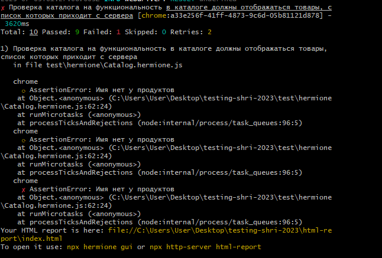
2 - баг
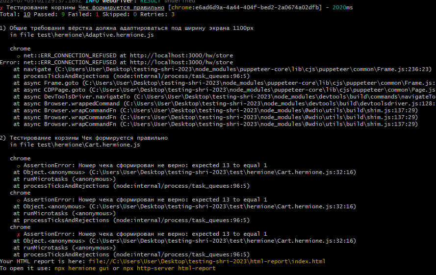
3 - баг
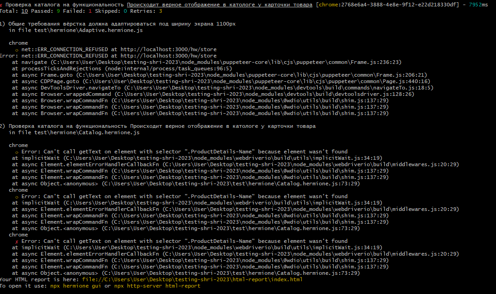

Остальные 7 bug_id я поймал с помощью unit тестов

4 - баг
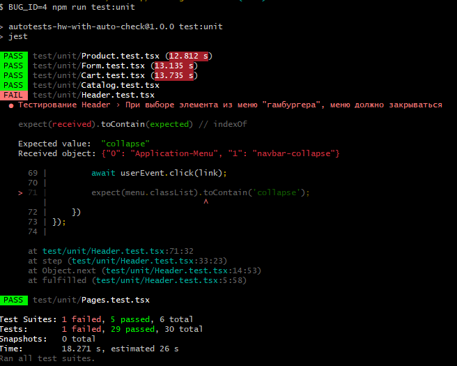
5 - баг
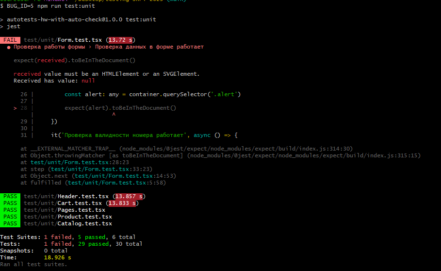
6 - баг
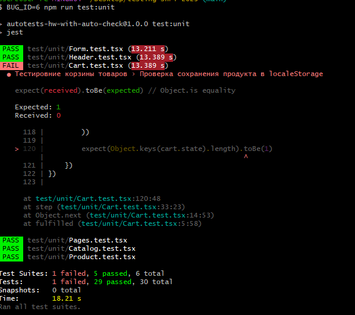
7 - баг

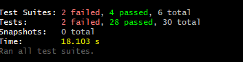

8 - баг
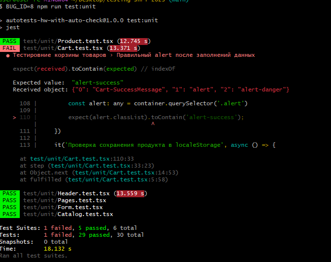
9 - баг
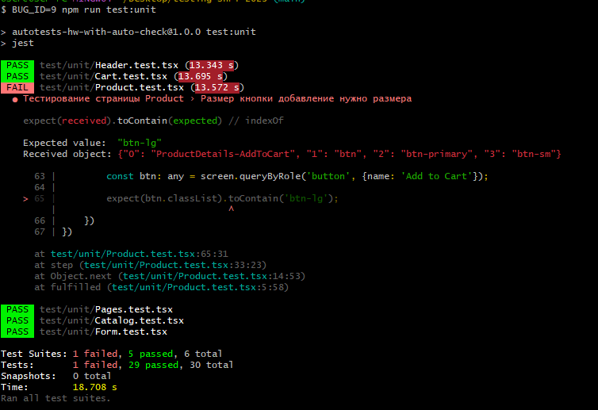
10 - баг
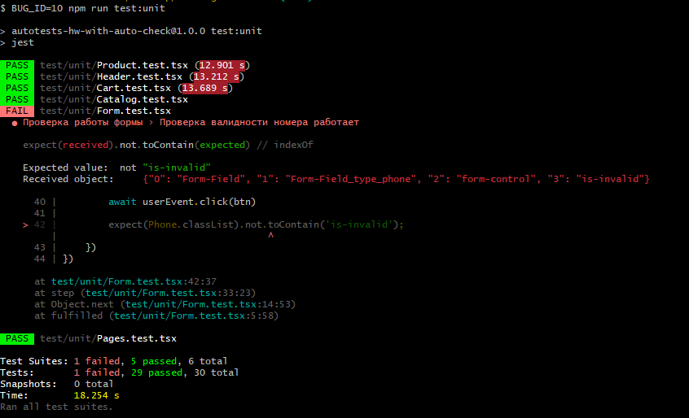

Также вот скриншоты того, что без bug_id все тесты полностью проходят

11 - all_e2e
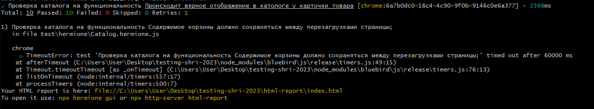
12 - all_unit
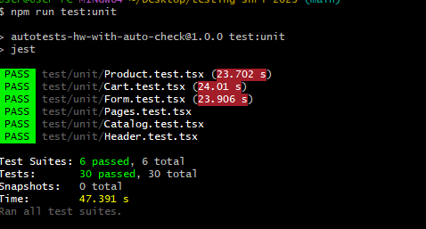


# Домашнее задание: Автотесты

Вам дано приложение — интернет магазин. С его помощью можно смотреть каталог товаров, добавлять товары в корзину и оформлять заказы.

Форкните этот репозиторий и напишите тесты, проверяющие правильность работы продуктовых сценариев. Проверяйте сценарии модульными/интеграционными тестами, на свое усмотрение.

Главный критерий проверки — автотесты должны находить баги. Дополнительный критерий — на каждый баг должно падать небольшое количество тестов (не больше 1-2).

## Функциональные требования

**Общие требования:**
- вёрстка должна адаптироваться под ширину экрана
- в шапке отображаются ссылки на страницы магазина, а также ссылка на корзину
- название магазина в шапке должно быть ссылкой на главную страницу
- на ширине меньше 576px навигационное меню должно скрываться за "гамбургер"
  - при выборе элемента из меню "гамбургера", меню должно закрываться

**Страницы:**
- в магазине должны быть страницы: главная, каталог, условия доставки, контакты
- страницы главная, условия доставки, контакты должны иметь статическое содержимое

**Каталог:**
- в каталоге должны отображаться товары, список которых приходит с сервера
- для каждого товара в каталоге отображается название, цена и ссылка на страницу с подробной информацией о товаре
- на странице с подробной информацией отображаются: название товара, его описание, цена, цвет, материал и кнопка "добавить в корзину"
- если товар уже добавлен в корзину, в каталоге и на странице товара должно отображаться сообщение об этом
- если товар уже добавлен в корзину, повторное нажатие кнопки "добавить в корзину" должно увеличивать его количество
- содержимое корзины должно сохраняться между перезагрузками страницы

**Корзина:**
- в шапке рядом со ссылкой на корзину должно отображаться количество не повторяющихся товаров в ней
- в корзине должна отображаться таблица с добавленными в нее товарами
- для каждого товара должны отображаться название, цена, количество , стоимость, а также должна отображаться общая сумма заказа
- в корзине должна быть кнопка "очистить корзину", по нажатию на которую все товары должны удаляться
- если корзина пустая, должна отображаться ссылка на каталог товаров


## Как запустить

```sh
# установите зависимости
npm ci

# соберите клиентский код приложения
npm run build

# запустите сервер
npm start
```

После этого можете открыть приложение в браузере по адресу http://localhost:3000/hw/store

## Как проверять

Вы можете запускать приложение с параметром `bug id`, который может принимать значение от 1 до 10. Каждое из значений `bug id` добавляет в работу приложения какой-то баг. Проверьте, что без параметра `bug id` все тесты проходят, а для каждого значения `bug id` падают 1-2 теста.

Как передать `bug id`:
- при запуске интеграционных тестов передавайте значение в параметре запроса, например, http://localhost:3000/hw/store/catalog/0?bug_id=9
- при запуске модульных тестов передавайте значение в переменной окружения `BUG_ID`, например, `BUG_ID=1 npm run test`
